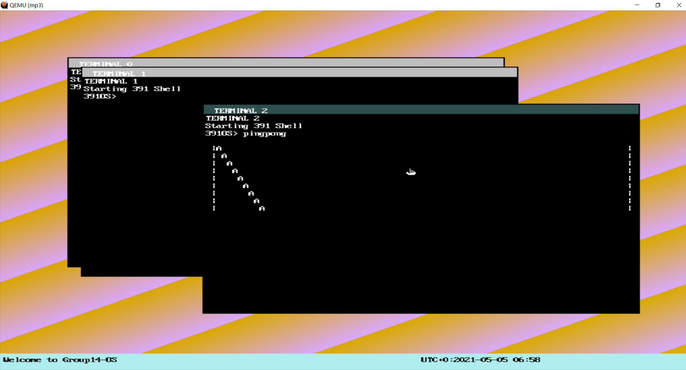

# Group 14: Krizz (HEROS)
- Shen Zheng (shenz2)
- Zhenning Zhang (zz45)
- Kanya Mo (kanyamo2)
- Ruiqi Li (ruiqili4)

# Basic
-  GDT, IDT, Paging Setup
-  PIT, Keyboard, RTC Interrupt handler
-  File System 
-  System Calls
-  Round-robin Scheduler
-  Multiple Terminals
# Extra
- PIT PC Speaker
  * Error Alarm  
- Sound Blaster 16 (Audio Card) Driver and WAV Decoder
  * Startup Sound
  * WAV Decoder and Player
  * Double Channel, 8-bit Width, 44100 sample rate WAV file
- VESA sVGA 1024 x 768 16-bit high color
  * double buffer
- GUI with multiple terminals
  * Status Bar
  * Terminal Dragging Using Mouse 
  * Window Hierarchical Layer Support
  * Focus Terminal Maintaining
- PS/2 Mouse Driver 
- CMOS Datetime  
- Signal
- Virtualized RTC 
  * acceleration when scheduling
- Randomness

# Screenshot
